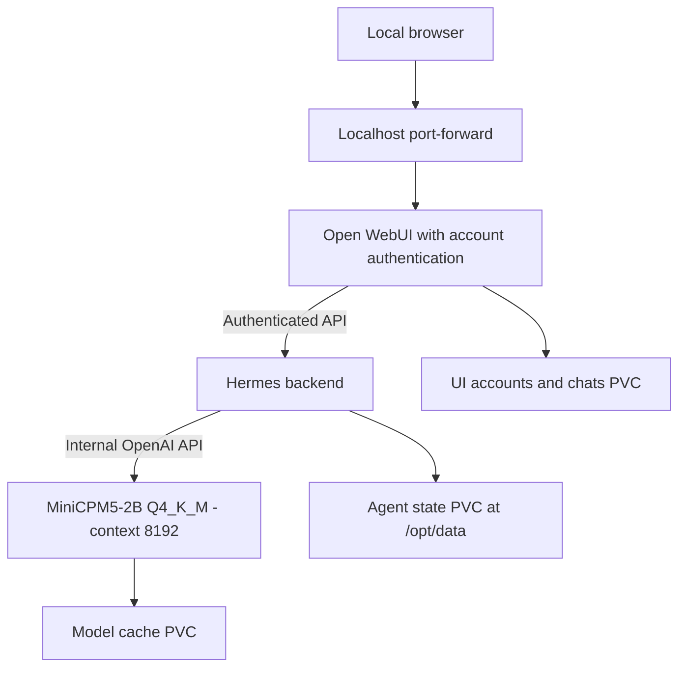

# Hermes Kubernetes design review

Three separate ARM64 workloads, a reusable Helm/PowerShell installer, and real cluster tests. No deployment changes yet.

<Compare>
## One Helm release, separate workloads (pick)
- pro: Coordinated routing, secrets, upgrades and tests
- pro: All three components remain separate
- con: Release lifecycle is shared

## Three Helm releases
- pro: Independent upgrades
- con: Extra routing and secret coordination

## Bundled Hermes dashboard
- pro: Fewer moving parts
- con: Not the agreed separate frontend
</Compare>

<Callout type="risk">
Each node has 1830m allocatable CPU. The model starts with a 1000m CPU request, not the unschedulable 2-CPU request in the original plan. StorageClass and image digests will be verified before deployment.
</Callout>

<FileTree>
- add helm/hermes-stack/ -- reusable chart
- add scripts/Deploy-Hermes.ps1 -- preflight and repeatable installation
- add scripts/Test-Hermes.ps1 -- live checks and sanitized report
- add tests/ -- chart and script regression checks
- add README.md -- install, access, rollback and data retention
- add .gitignore -- exclude credentials and private generated files
</FileTree>

<Checklist title="Required verification">
- [ ] Helm lint/render and PowerShell syntax/negative-case tests
- [ ] ARM64 images, PVCs and workload readiness
- [ ] Model inference and authenticated Hermes chat
- [ ] Real Hermes tool execution verified by a harmless marker file
- [ ] UI health and upstream routing; enrollment-dependent checks reported honestly
- [ ] Restart persistence, secret preservation and Helm tests
</Checklist>

<Callout type="note">
Services stay private. No public ingress or Kubernetes API credentials are mounted into the agent. This is an end-to-end smoke suite, not a claimed 200-call reliability benchmark.
</Callout>

<Questions title="Written design approval">
- Does the written deployment design capture what you want?
  - Approve the written design and proceed to implementation planning
  - Revise the written design
</Questions>

Full specification: `docs/superpowers/specs/2026-10-01-hermes-kubernetes-design.md`.
