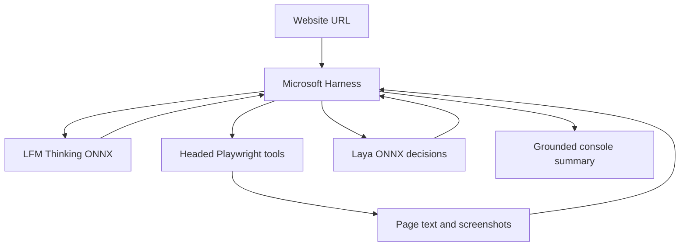

# Local C# Website Summary Bot

<Callout type="decision">
Design approved. Implementation stays fully local in C#/.NET: no Python service and no replacement models.
</Callout>

<Phase title="Native model foundation" status="planned">
Pin model revisions and packages; download and verify weights. Test exact native tokenizer IDs against reference fixtures.
</Phase>

<Phase title="Two brains and Harness protocol" status="planned">
Implement Laya typed probabilities and LFM cached generation. Test genuine tool choices; reject malformed actions rather than silently scripting navigation.
</Phase>

<Phase title="Visible browser tools" status="planned">
Headed Chromium with animated cursor overlay. Extract real visible text, click observed links, enforce origin/network limits, and capture evidence.
</Phase>

<Phase title="Compose and validate live" status="planned">
Update Program.cs; run full tests and a real OpenPlateStudio session. Inspect both-model usage, Harness tool logs, screenshots, and summary grounding.
</Phase>

<FileTree>
- modify harness/Program.cs -- composition and CLI entry point
- modify harness/Harness.csproj -- pinned dependencies
- add harness/Models/ -- native tokenizer and two ONNX adapters
- add harness/Agent/ -- validated Harness chat/tool protocol
- add harness/Browser/ -- visible tools, URL policy and evidence
- add tests/Harness.Tests/ -- unit, real-model and browser validation
- add scripts/Setup-WebsiteBot.ps1 -- reproducible setup
- add docs/website-summary-validation.md -- measured live results
- modify README.md -- setup and run commands
</FileTree>

<Callout type="risk">
The 1.2B thinking model's tool reliability is not established. Successful model loading is insufficient: completion requires actual Harness-directed browsing and a grounded summary. The visible cursor is a browser overlay, not the Windows mouse pointer.
</Callout>

<Checklist title="Completion evidence">
- [ ] Build and automated tests pass
- [ ] Exact requested models execute locally in C#
- [ ] Actual Harness invokes browser and Laya tools
- [ ] Headed live run visibly navigates OpenPlateStudio
- [ ] Summary agrees with captured page text and source URLs
- [ ] Setup commands and evidence are documented
</Checklist>

Detailed task interfaces, test cycles and commands: [implementation plan](./2026-10-02-website-summary.md).

<Questions title="Approve plan and execution">
- Does this implementation plan capture what you want, and how should I execute it?
  - Approve — native execution in this session (recommended)
  - Approve — subagent-driven implementation and review
  - Request changes before implementation
</Questions>

